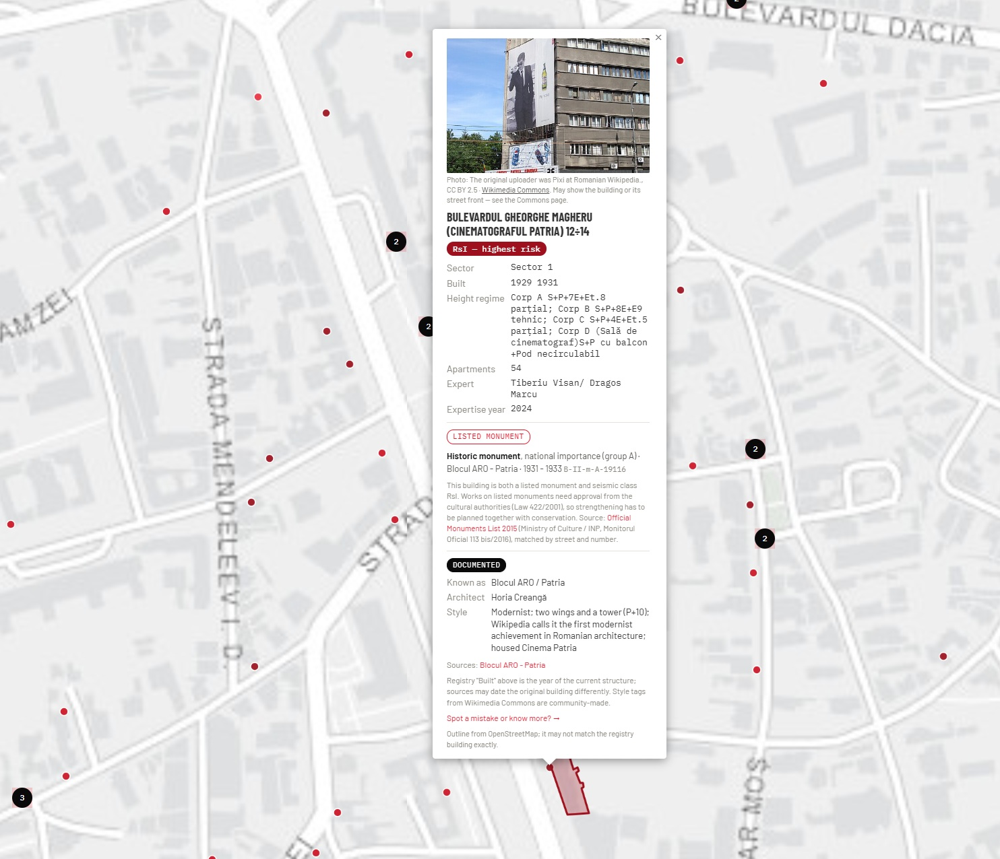

# Bucharest Seismic Risk Map

**See which of Bucharest's buildings are officially flagged as seismic risks, where they are, and what we know about their history.**

**[Open the live map](https://dana-juncu.github.io/bucharest-seismic-risk-map/index.html)**

[](https://dana-juncu.github.io/bucharest-seismic-risk-map/index.html)

Bucharest sits in one of Europe's most active seismic zones, and the city's official list of at-risk buildings is a registry of PDFs and tables that is hard to explore. This project puts all **2,796 buildings** on one fast, searchable map, in plain language, with no sign-up and nothing to install.

## What you can do

- **Find any building.** Search by address, or filter by risk class and sector.
- **Understand the risk.** Colours follow the official classes, from RsI (highest risk) to RsIV, plus retrofitted ("consolidated") and not-yet-classified buildings. A plain-language legend explains what each class means.
- **Read a building's story.** Open a popup to see the year built, height, the expert who assessed it, and, where public sources have it, the architect, style, historical owner and a photo. Every fact links to its source.
- **See heritage status.** About 300 buildings are on the official Monuments List (national or local importance), and about 400 more sit on streets in protected built zones. The card shows both, flags buildings that are listed monuments *and* seismic class RsI to RsIII, and a filter shows only heritage buildings.
- **Spot the gaps.** A filter shows how well each building is documented, and a coverage bar shows how much is still unknown. Addresses that could not be placed reliably are listed separately instead of being guessed at.
- **See the building, not just a dot.** Hover a pin to see the building's outline from OpenStreetMap, and click it to keep the outline while the card is open. Outlines matched only by proximity are drawn dashed.
- **Take the data with you.** A "Download the data" section exports the buildings on screen, or all 2,796, as CSV or GeoJSON, including the history and heritage columns. Free to reuse with attribution.
- **Use it on your phone.** The layout adapts, and the building list opens as a sheet so the map stays fully visible.

## Why it is different

- **Honest about uncertainty.** The map says "partly documented" or "no history found yet" rather than filling gaps. Low-confidence facts are marked "unverified".
- **Everything is cited.** Registry data comes from AMCCRS; history comes from the official Monuments List 2015, City Hall protected-zone documents, Wikipedia, Wikimedia Commons, Wikidata and OpenStreetMap. No street-level imagery is analysed.
- **Free and open.** A static site with no server, no tracking and no API keys. The code is MIT-licensed.

## Help improve it

Know a building's architect, history or a better photo? Every popup has a **"Spot a mistake or know more?"** link that opens a prefilled GitHub issue. A source link (a book, an archive or a web page) makes a fix easy to accept.

## Run it yourself

It is a static page, so there is nothing to build:

```bash
git clone https://github.com/dana-juncu/bucharest-seismic-risk-map
cd bucharest-seismic-risk-map
python -m http.server 8000   # then open http://localhost:8000
```

To host your own copy on GitHub Pages: Settings, Pages, "Deploy from a branch", `main`, `/ (root)`.

## How it works

| File | Role |
|---|---|
| `index.html` | The map and interface (Leaflet) |
| `buildings.js` | The 2,796 registry buildings with risk class and coordinates |
| `history-data.js`, `history-photos.js`, `heritage-data.js`, `history-card.js` | The optional history layer: history, photos, monument and protected-zone data, and the popup card |
| `export-data.js` | The CSV and GeoJSON download buttons |
| `footprints.js`, `outlines.js` | Building outlines (OpenStreetMap) and the code that draws them on hover and click |
| `pipeline/` | Scripts that rebuild `buildings.js` from the live AMCCRS registry |

The registry is pulled through [RoPublicData](https://github.com/dana-juncu/ro-public-data), a keyless MCP server for Romanian public data, then cleaned, geocoded with OpenStreetMap Nominatim and written to `buildings.js`:

```bash
cd pipeline
# 1. Pull fresh AMCCRS data (see fetch_amccrs.py)  ->  amccrs_raw.json
python parse_and_normalize.py
python geocode_buildings.py --candidates buildings_for_geocoding.csv --out buildings_geocoded.csv
python build_buildings_js.py --in buildings_geocoded.csv --out ../buildings.js
python fetch_footprints.py --buildings ../buildings.js --out ../footprints.js   # building outlines, about 5 minutes
```

Geocoding respects Nominatim's one-request-per-second policy, so a full run takes about an hour.

## Good to know

- About 39% of registry rows carry a formal RsI to RsIV class. Most of the rest carry only an emergency category (U1, U2 or U3) from the 1990s, which the map shows separately, about 150 have no code at all, and about 4% have been retrofitted. The map shows these as the separate categories they are.
- The registry's "Built" year is the year of the current structure, which historical sources may date differently.
- Photos are loaded from Wikimedia Commons when a card opens, each with its author and licence. Some may show a neighbouring building. Please report any you spot.

## Data sources and licences

- **Building safety records:** AMCCRS (Autoritatea Municipală pentru Consolidarea Clădirilor cu Risc Seismic), via RoPublicData.
- **Geocoding and building data:** © [OpenStreetMap](https://www.openstreetmap.org/copyright) contributors, [ODbL](https://opendatacommons.org/licenses/odbl/).
- **Heritage:** the official List of Historic Monuments 2015 (Ministry of Culture / Institutul Național al Patrimoniului, Monitorul Oficial 113 bis/2016) and the protected built zones approved by the Bucharest City Council (HCGMB 279/2000). Monuments are matched by street and number; protected zones only by street name, because the official zone documents are plans without coordinates.
- **Building history:** [Wikipedia](https://ro.wikipedia.org) (CC BY-SA 4.0), [Wikimedia Commons](https://commons.wikimedia.org) (licence per photo, shown on each card) and [Wikidata](https://www.wikidata.org) (CC0).
- **Building outlines:** © [OpenStreetMap](https://www.openstreetmap.org/copyright) contributors, ODbL, fetched through the Overpass API.
- **Basemap tiles:** Esri.

The code is MIT-licensed (see `LICENSE`). The underlying data and photos keep their own licences; this project claims no rights over them.

## Disclaimer

Independent, unofficial and non-commercial. **This is not a safety assessment.** For a building's current seismic-risk status, consult AMCCRS or Primăria Municipiului București directly. The history information comes from public sources, may contain errors and is not a heritage or legal record. This project is not affiliated with AMCCRS, Primăria Municipiului București, or any other Romanian government body.

## Built by

[Dana Juncu](https://linkedin.com/in/danajuncu)
